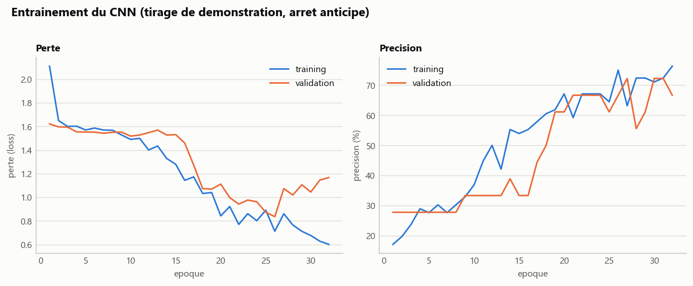
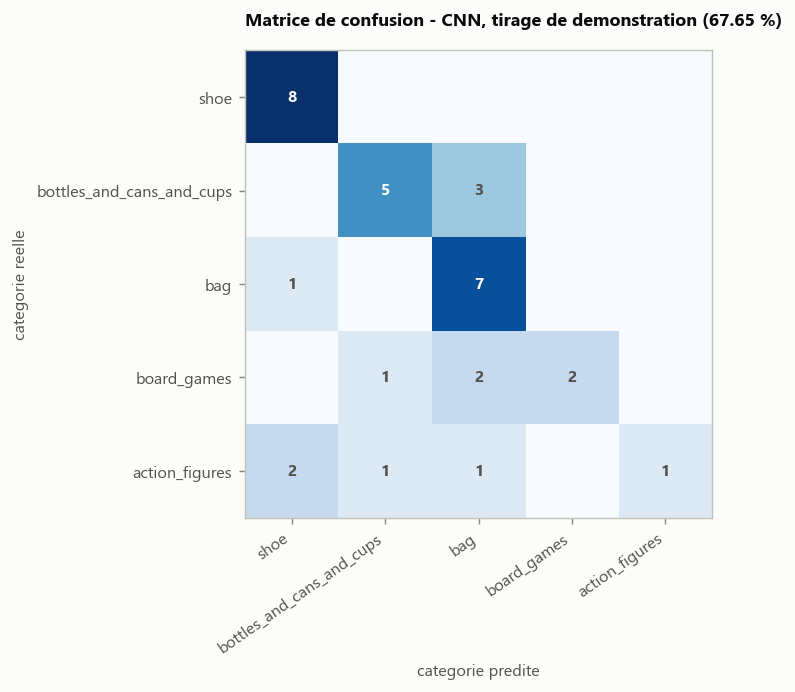

# Classification par CNN

Reprend `parking-old/05-parking-cnn` : au lieu d'un descripteur fait main
(LBP, `01-objets3d-lbp` et `02-objets3d-lbp-multiechelle`), un petit CNN
apprend directement sur les pixels de l'image composite 6-vues (couleur,
768x128, redimensionnee en 384x64 pour l'entrainement). Multi-classe cette
fois (5 categories, sortie softmax) au lieu du binaire libre/occupe.

## Protocole

Le train/test reste celui fixe au telechargement des objets (94 / 34
images, voir `01-objets3d-lbp/manifest.csv`). Contrairement a
`parking-old/05` qui repioche 200 + 200 imagettes dans un grand pool a
chaque tirage, nos categories n'ont que 17 a 53 objets au total : impossible
de retirer des splits vraiment differents sans repetition. Les "graines"
d'entrainement (`benchmark.py`, 10 executions) font donc varier
l'initialisation des poids, l'augmentation de donnees et le decoupage
train/validation interne, pas les donnees elles-memes : ca quantifie la
variance de l'entrainement, pas celle de l'echantillonnage.

## Architecture (`cnn.py`)

```
Rescaling(1/255)
RandomFlip + RandomTranslation + RandomZoom   (entrainement seulement)
Conv2D(16, 3) -> MaxPooling2D(2)
Conv2D(32, 3) -> MaxPooling2D(2)
Conv2D(64, 3) -> MaxPooling2D(2)
Flatten -> Dense(64) -> Dropout(0.5) -> Dense(5, softmax)
```

`EarlyStopping` sur la perte de validation (decoupe stratifiee 80/20 du
training), comme dans `parking-old/05`.

## Resultats

**76,77 % de moyenne sur 10 graines d'entrainement** (ecart-type 5,95, de
67,65 % a 88,24 %).


Le CNN rejoint a peu pres le LBP **global** (76,47 %) mais reste nettement
en dessous du LBP **pyramidal** (91,18 %, `02-objets3d-lbp-multiechelle`).
A l'inverse de `parking-old` (ou le CNN, avec 200 imagettes pour 2
categories, egalait presque le meilleur LBP), ici 94 images pour 5
categories (12 a 25 par categorie) ne suffisent pas a un CNN entraine de
zero pour rivaliser avec un descripteur fait main qui exploite la structure
spatiale : conclusion attendue, et coherente avec la litterature (les CNN
ont besoin de nettement plus de donnees par classe que les methodes a
descripteur).



Les courbes du tirage de demonstration (graine 0, 67,65 %) montrent une
validation bruitee typique d'un si petit jeu (34 images de validation) :
l'arret anticipe stoppe l'entrainement avant que l'ecart training/validation
ne se creuse davantage.



## Explications visuelles (`resultats/classification/`)

A la difference du LBP (01/02) qui affiche le plus proche voisin
d'entrainement, le CNN n'a pas de "voisin" explicite : `explain_classification.py`
affiche a la place les probabilites qu'il attribue a chaque categorie
(sortie softmax), rangees dans `bien_classes/` ou `mal_classes/`.

## Utilisation

```
pip install -r requirements.txt

python classify.py --seed 0                 # un seul tirage, matrice de confusion
python benchmark.py --runs 10                # resultats/benchmark.csv
python figures.py                             # les 3 graphes ci-dessus
python explain_classification.py --seed 0     # bien_classes/ et mal_classes/
```
