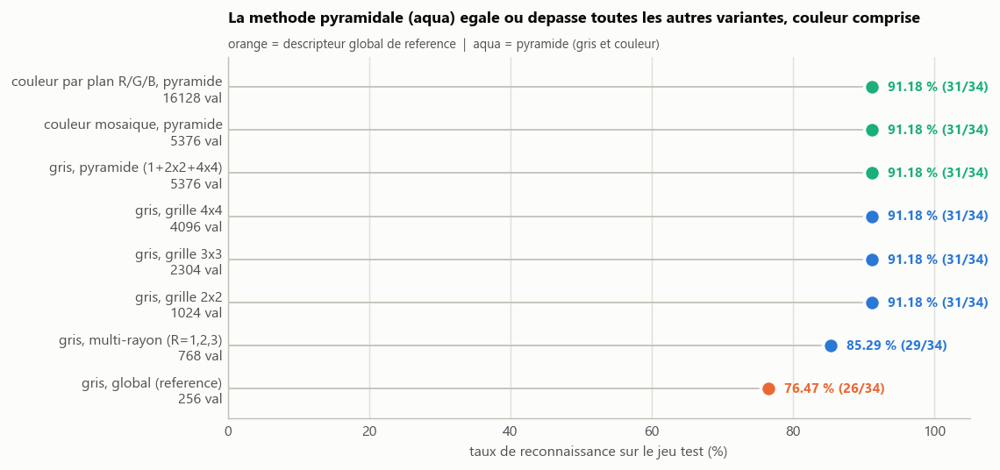
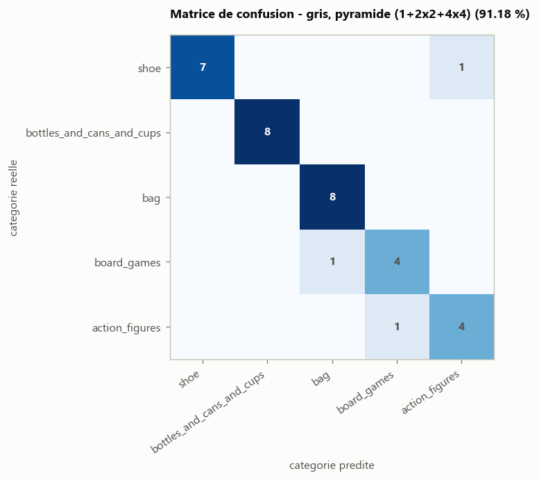
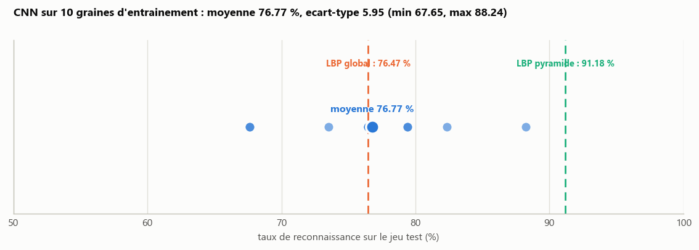

# multiview-3D-lbp-cnn

Caracterisation d'objets 3D (categorie : chaussure, bouteille/canette/gobelet,
sac, jeu de societe, figurine) a partir d'images composites 6-vues rendues
depuis de vrais objets scannes, avec la meme demarche que `parking-old` :
LBP global -> LBP multi-echelle/couleur -> CNN.

## Donnees

[Google Scanned Objects](https://research.google/blog/scanned-objects-by-google-research-a-dataset-of-3d-scanned-common-household-items/)
(objets reels scannes, maillage + texture, licence CC-BY 4.0) : 128 objets
(94 train / 34 test) repartis en 5 categories inegales (12 a 25 objets par
categorie a l'entrainement - voir `01-objets3d-lbp/manifest.csv`).
Chaque objet est rendu sous 6 angles (face, dos, droite, gauche, dessus,
dessous), concatenes en une seule image composite 768x128.

## Les trois etudes

| Dossier | Methode | Taux (jeu test, 34 images) |
| --- | --- | --- |
| [`01-objets3d-lbp/`](01-objets3d-lbp/) | LBP global, 1-plus-proche-voisin, 7 metriques de distance | 76,47 % (L1) a 88,24 % (Chi-2) |
| [`02-objets3d-lbp-multiechelle/`](02-objets3d-lbp-multiechelle/) | LBP multi-echelle (grille, pyramide, multi-rayon) x couleur (gris/mosaique/par plan) | **91,18 %** (pyramide, gris ou couleur) |
| [`03-objets3d-cnn/`](03-objets3d-cnn/) | CNN entraine de zero sur les pixels (couleur) | 76,77 % de moyenne sur 10 graines (67,65 - 88,24 %) |

## Graphiques : ce qu'ils montrent

Chaque etude a son propre `resultats/` avec ses figures ; celles qui suivent
sont les seules a porter une conclusion en soi (les autres, listees en fin
de section, sont surtout pedagogiques).

### `02-objets3d-lbp-multiechelle/resultats/comparaison-modes.png`



Le graphique le plus important du depot. Il separe les deux ameliorations
testees dans `parking-old` (03 = couleur, 04 = multi-echelle) et montre
laquelle compte vraiment ici :

- **decouper l'image en blocs fait tout le travail** : 76,47 % (LBP global)
  -> 91,18 % des la grille 2x2, sans gain supplementaire au-dela (3x3, 4x4 et
  pyramide font jeu egal). La position des motifs dans l'image composite
  (quelle vue, quelle zone) est donc une information determinante.
- le **multi-rayon** (voisinage circulaire) aide un peu (85,29 %) mais
  nettement moins que le decoupage spatial.
- la **couleur n'apporte rien** : mosaique et LBP par plan R/G/B, une fois
  combines a la pyramide, retombent exactement sur les 91,18 % du gris. Le
  LBP est invariant aux changements monotones d'intensite, et un objet
  scanne garde globalement la meme texture locale d'un plan de couleur a
  l'autre.

### `02-objets3d-lbp-multiechelle/resultats/confusion-gris_pyramide.png`



Sur le meilleur mode LBP, les 3 erreurs restantes (sur 34) se concentrent
entre `board_games` et `action_figures` : precisement les deux categories
les plus pauvres en exemples (12 objets a l'entrainement, contre 20 a 25
pour les trois autres). Le manque de diversite d'objets par categorie -
deja la principale limite de datasets comme Washington RGB-D - se retrouve donc, a plus petite echelle, jusque
dans le choix de nos propres quotas par categorie.

### `03-objets3d-cnn/resultats/benchmark-cnn.png`



Contrairement a `parking-old/05` (ou le CNN, avec 200 imagettes pour 2
categories, approchait le meilleur LBP), ici le CNN plafonne autour du LBP
**global** (moyenne 76,77 % contre 76,47 %) et n'atteint jamais le LBP
**pyramidal** (91,18 %). La difference tient aux donnees, pas a la methode :
94 images entrainement pour 5 categories (12 a 25 chacune) ne suffisent pas
a un reseau entraine de zero pour apprendre une representation aussi
efficace qu'un descripteur fait main qui encode deja la structure spatiale.
C'est une confirmation, pas une surprise : les CNN sont gourmands en
donnees par classe, les descripteurs geometriques beaucoup moins.

### Les autres figures

`decoupage-blocs.png` et `rayons.png` (dans `02-...`) et
`courbes-entrainement.png` (dans `03-...`) illustrent le *fonctionnement*
des methodes (comment un bloc devient un histogramme, effet du rayon,
allure d'un entrainement) plutot qu'un resultat chiffre : utiles pour
comprendre la mecanique, sans conclusion supplementaire par rapport aux
trois graphiques ci-dessus. Idem pour les dossiers
`resultats/classification/{bien_classes,mal_classes}` de chaque etude : ce
sont des exemples qualitatifs image par image (utiles pour voir *pourquoi*
un objet precis a ete confondu), pas des mesures agregees.

## A retenir

1. Sur ce dataset, **la structure spatiale (blocs) domine largement la
   couleur** comme source d'amelioration du LBP.
2. **Le nombre d'objets par categorie** (12 a 25 ici, contre 100 dans
   `parking-old`) est le facteur limitant commun aux trois etudes : c'est
   lui qui explique a la fois les confusions residuelles du LBP pyramidal
   et l'echec du CNN a rivaliser avec lui.
3. Avec trop peu de donnees par classe, un descripteur fait main bien concu
   bat un CNN entraine de zero - l'inverse de ce qu'on observe des que les
   classes comptent des centaines d'exemples.

## Organisation du depot

```
01-objets3d-lbp/                   telechargement + rendu 6-vues + LBP global
02-objets3d-lbp-multiechelle/      LBP multi-echelle (pyramidal) x couleur
03-objets3d-cnn/                   CNN entraine sur les pixels
parking-old/                       depot d'origine (parking, non versionne ici)
```

Chaque dossier `0X-...` est autonome (son propre `README.md`, ses scripts,
son `resultats/`) et documente son propre protocole d'execution.
